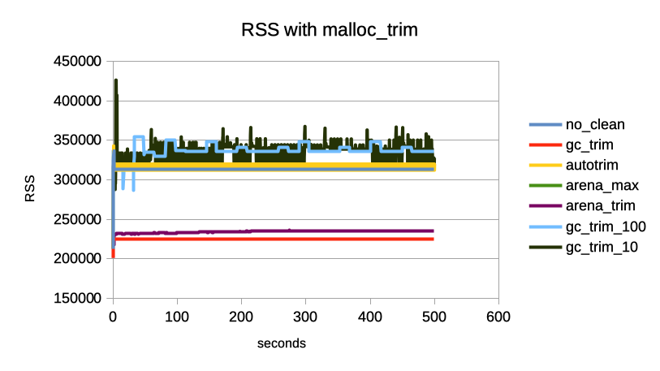

# Comparing Approaches

(`arena_max` and `no_clean` overlap each other on the graph exactly)

We compared different memory handling strategies while running a fake workload that allocates many objects and discards them again in `measure.rb`.

* `no_clean`: do nothing special, let ruby do whatever it does
* `gc_trim`: After every work unit, do a manual GC run and a `malloc_trim`
* `autotrim`: Hook into the ruby GC and do a `malloc_trim` after every GC mark phase
* `arena_max`: setting `MALLOC_ARENA_MAX=2`
* `arena_trim`: setting `MALLOC_ARENA_MAX=2` and do the `gc_trim` strategy on top

The measure script ran 500 seconds where `gc_trim` was slower than the other approaches:

* `no_clean`:   5.889 `work`-calls per second (2945 total invokations of `work` calls in 500 seconds)
* `gc_trim`:    5.343 `work`-calls per second (2672 total invokations of `work` calls in 500 seconds)
* `autotrim`:   5.809 `work`-calls per second (2905 total invokations of `work` calls in 500 seconds)
* `arena_max`:  6.038 `work`-calls per second (3020 total invokations of `work` calls in 500 seconds)
* `arena_trim`: 5.609 `work`-calls per second (2805 total invokations of `work` calls in 500 seconds)

For some reason `autotrim` seems not to be effective. Setting of `MALLOC_ARENA_MAX` seems not to reduce memory usage as much in this workload.

Since trimmings seems to work nice on this workload, but perform slower, we experimented with only running it every 10th (`gc_trim_10`) iteration or every 100th (`gc_trim_100`) iteration.

Somehow, memory usage seems to be much higher and, at the same time, much more variable.

## Technical details

This is all run in ruby 2.6.2p47 (2019-03-13 revision 67232) [x86_64-linux] on a mac book pro running the `ruby:2.6` docker container (because MacOS does not have `malloc_trim`).
